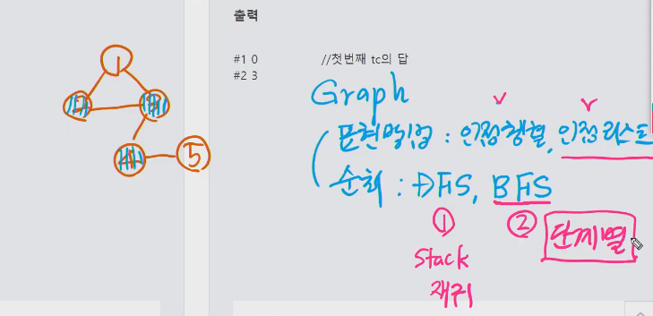
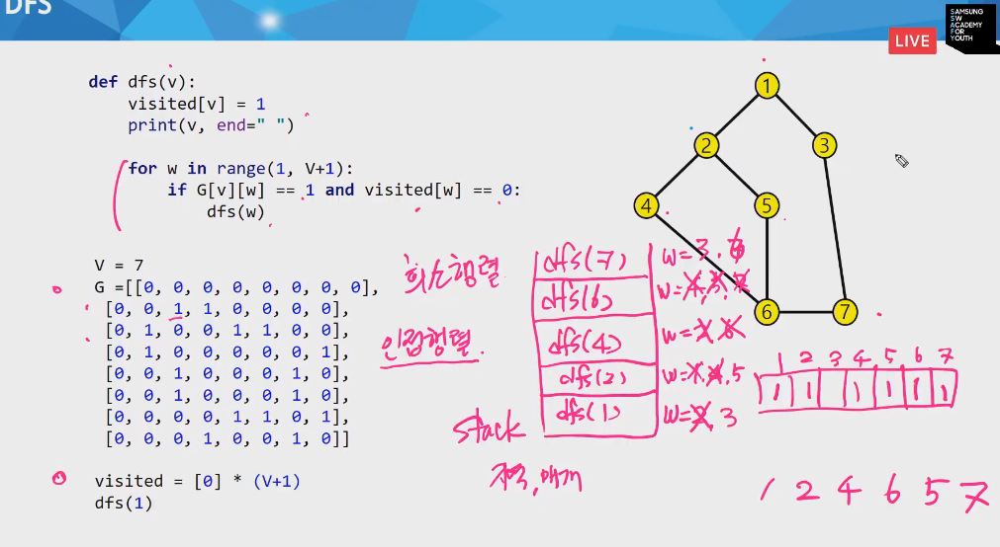
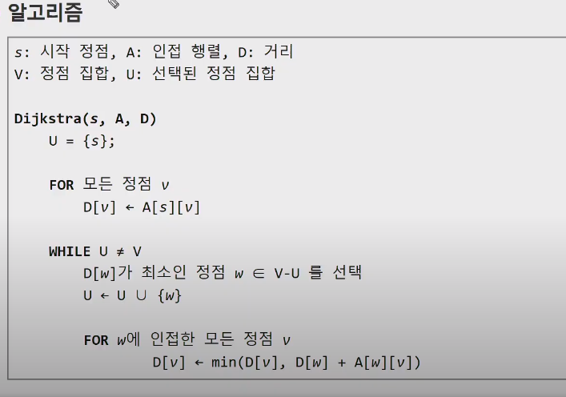

# 20200604 algo - Binary Tree

### 공통조상

- 이차원배열 저장
  - left right parent - 0, 1, 2

```python

import sys

sys.stdin = open('input_1248.txt')


def searchAnce(n):
    s = tree[n][2]
    p = []
    while s:
        p.append(s)
        s = tree[s][2]
    return p


def findA(p1, p2):
    for i in range(len(p1)):
        for j in range(len(p2)):
            if p1[i] == p2[j]:
                return p1[i]
    return 0


def preorder(node):
    global cnt
    if node != 0:
        cnt += 1
        preorder(tree[node][0])
        preorder(tree[node][1])


T = int(input())

for tc in range(1, T+1):
    V, E, v1, v2 = map(int, input().split())
    tree = [[0 for _ in range(3)] for _ in range(V+1)]
    temp = list(map(int, input().split()))
    p1 = []
    p2 = []
    cnt = 0
    for i in range(E):
        p = temp[i*2]
        c = temp[i*2 + 1]
        if not tree[p][0]:
            tree[p][0] = c
        else:
            tree[p][1] = c
        tree[c][2] = p

    # 인접 노드 l, r, p로 행렬로 저장하기.

    p1 = searchAnce(n1)
    p2 = searchAnce(n2)
    CA = findeA(p1, p2)
    preorder(CA)

    print(f'#{tc} {p} {cnt}')

```

## 5522 상원이의 생일파티

- 그래프

  - 표현방법 : 인접행렬, 인접 리스트
  - 순회: DFS(스택 - 재귀), BFS(단계별로 )
    - 순회: 희소행렬, 인접행렬 단접 : 메모리공간 많이 사용됨.

  

- DFS




```python 

import sys

sys.stdin = open('input_5521.txt')


def dfs(v):
    visited[v] = 1
    print(v, end=" ")
    for w in range(1, V+1):
        if G[v][w] == 1, and visited[w] == 0:
            dfs(w)


T = int(input())

for tc in range(1, T+1):
    N, M = int(input())
    d = map(int, input().split())
    visited = [0] * (V+1)
    dfs(1)

    print(f'#{tc} {minV}')

```

- BFS 
  - 인접정점 이용
  - 큐=> 인큐 => visit => 할일


```py
def bfs(v):
    q = []
    q.append(v)
    visited[v] = 1
    print(v, end=" ")
    while q:
        v = q.pop(0)
        for w in G[v]:
            if not visited[w]:
                q.append(w)
                visited[w] = visited[v] +1
                print(w, end=" ")
T = int(input())

for tc in range(1, T+1):
    N, M = int(input())
    d = map(int, input().split())
    visited = [0] * (V+1)
    bfs(1)
```

## 다익스트라, 플로이드 => 최단경로 구현이 쉽다.



- 보급로 1249

- 다익스트라

```python

import sys
sys.stdin = open('input_1249.txt')

# 다익스트라, 플로이드 => 최단경로 구현이 쉽다.


def dfs(x, y, temp):
    s = []
    s.append((x, y, temp))
    while s:
        i, j, t = s.pop(0)
        v[i][j] = t
        for r, c in rc:
            nx = i+r
            ny = j+c
            if 0 <= nx < N and 0 <= ny < N and v[nx][ny] > t+d[nx][ny]:
                v[nx][ny] = t+d[nx][ny]
                s.append((nx, ny, v[nx][ny]))
    return v[N-1][N-1]


T = int(input())
for tc in range(1, T+1):
    N = int(input())
    d = [[]*N for _ in range(N)]
    for i in range(N):
        d[i] = list(map(int, input()))
    rc = [(1, 0), (0, -1), (0, 1), (-1, 0)]
    v = [[float('inf')]*N for _ in range(N)]
    minV = float('inf')

    print(f'#{tc} {dfs(0, 0, 0)}')

```

- 재귀

  ```python
  import sys
  sys.stdin = open('input_1249.txt')
  
  
  def f(x, y, temp):
      global minV
      if minV < temp:
          return 1
      if (x == N-1) and (y == N-1):
          if minV > temp:
              minV = temp
          return
      for r, c in rc:
          if 0 <= x+r < N and 0 <= y+c < N and v[x+r][y+c] > temp+d[x][y]:
              nx = x+r
              ny = y+c
              v[nx][ny] = temp+d[x][y]
              if f(nx, ny, temp+d[x][y]) == 1:
                  return
  
  
  T = int(input())
  for tc in range(1, T+1):
      N = int(input())
      d = [[]*N for _ in range(N)]
      for i in range(N):
          d[i] = list(map(int, input()))
      rc = [(1, 0), (0, -1), (0, 1), (-1, 0)]
      v = [[float('inf')]*N for _ in range(N)]
      g = [N-1, N-1]
      minV = float('inf')
      v[0][0] = 0
      f(0, 0, 0)
      print(f'#{tc} {minV}')
  
  ```

  