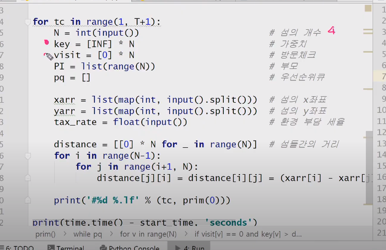

# 20200605

### MST(최소신장트리)

> 송유관 건설 시 이용됨, 네트워크 선 구축시

완전그래프에서 가중치가 최소인 것을 찾아라.

- Prim( O(n^2)) : 다익스트라와 비슷하다. 
  - 싸이클이 생기지 않는다. 서로소의 개념.
- Kruskal( O(MlogM) M : 간선의 개수.)


1251 - 하나로 문제




```python
Prim( O(n^2)) : 다익스트라와 비슷하다. 
import heapq
import sys

sys.stdin = open('input_1251.txt')


def f(start):
    total = 0
    key[start] = 0
    heapq.heappush(pq, (key[start], 0))

    while pq:
        distance, u = heapq.heappop(pq)
        if visit[u]:
            continue
        visit[u] = 1
        total += dist[PI[u]][u]*E
        # total += distance*E

        for v in range(N):
            if visit[v] == 0 and key[v] > dist[u][v]:
                key[v] = dist[u][v]
                PI[v] = u
                heapq.heappush(pq, (key[v], v))

    return total


T = int(input())
for tc in range(1, T+1):
    N = int(input())
    PI = list(range(N))  # 부모
    pq = []  # 우선순위큐
    x = list(map(int, input().split()))
    y = list(map(int, input().split()))
    E = float(input())

    INF = float('inf')
    key = [INF] * N             # 가중치
    visit = [0]*N

    dist = [[0]*N for _ in range(N)]
    for i in range(N-1):
        for j in range(i+1, N):
            dist[j][i] = dist[i][j] = (x[i] - x[j])**2 + (y[i] - y[j])**2

    print('#%d %.lf' % (tc, f(0)))

```

