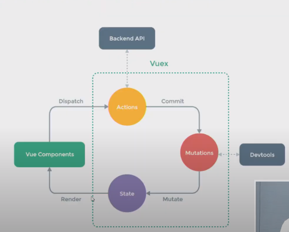
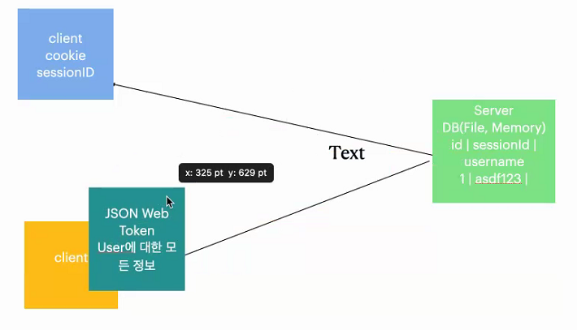

# 20200608 Vuex

### 로직을 중앙화 했다.

> 각 컴포넌트들의 로직들을 store에 모두 합하자. 결과적으로 템플릿만이 남는다.




- vue app 상태관리패턴 + 라이브러리

> flux 라이브러리는 안경과 같다. 필요할 때 쓰게 된다.
>
> 핵심은 state
>
> computed에 데이터를 조작.

- 중앙집중식 저장소 역할.


- 확장성


- 시작

```
vue add vuex
폴더명에서 임포트구문이 끝난 경우 index파일을 찾아 임포트해온다.

```

```js
store/index.js
// data 의 집합(중앙 관리할 모든 데이터===상태)
  state
  
// state 를 (가공해서)가져올 함수들. === computed
  getters
  
 // state 를 변경하는 함수들(mutations 에 작성되지 않은 state 변경 코드는 모두 동작하지 않음.)
  // 모든 mutation 함수들은 동기적으로 동작하는 코드.all
  // commit 을 통해 실행함. 
  mutations
  
// 범용적인 함수들. mutations 에 정의한 함수를 actions 에서 실행 가능.
  // 비동기 로직은 actions 에서 정의.
  // dispatch 를 통해 실행함
  actions
```

- getters computed 매핑

```
<script>
import { mapGetters } from 'vuex'

export default {
    name: 'VideoDetail',
    computed: {
      // computed 에 getters 를 매핑
      ...mapGetters([
        'videoUrl',
        'videoTitle',
        'videoDescription'
      ])
    }
}
</script>
```

- mutaition mapping

```
<script>
import { mapActions } from 'vuex' 

export default {
    name: 'SearchBar',
    methods: {
        ...mapActions([
            'fetchVideos'
        ])
    },
}
</script>
```

- action

```
actions: {
    fetchVideos({ commit, state } , event) {
      // 1. inputValue 를 바꾼다.
      commit('setInputValue', event.target.value)
      // 2. state.inputValue 로 요청보낸다.
      axios.get(API_URL, {
        params: {
          key: API_KEY,
          part: 'snippet',
          type: 'video',
          q: state.inputValue,
        }
      })
        .then(res => { 
          res.data.items.forEach(item => {
            const parser = new DOMParser()
            const doc = parser.parseFromString(item.snippet.title, 'text/html')
            item.snippet.title = doc.body.innerText
          })
          // 3. state.videos 를 응답으로 바꾼다.
          commit('setVideos', res.data.items)
        })
        .catch(err => console.error(err))
    }
  },
```

models.py

serializers.py

views.py

---

## Zoom

## token

- json webtoken : RFC7519(산업의 표준과 같다.)




# tips


