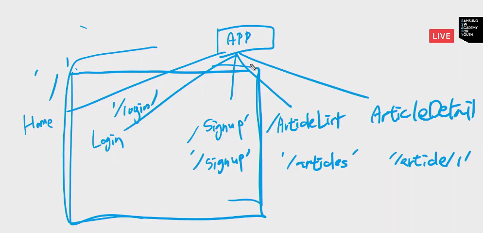
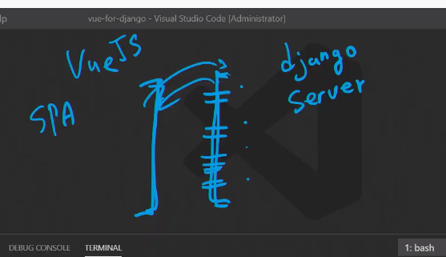
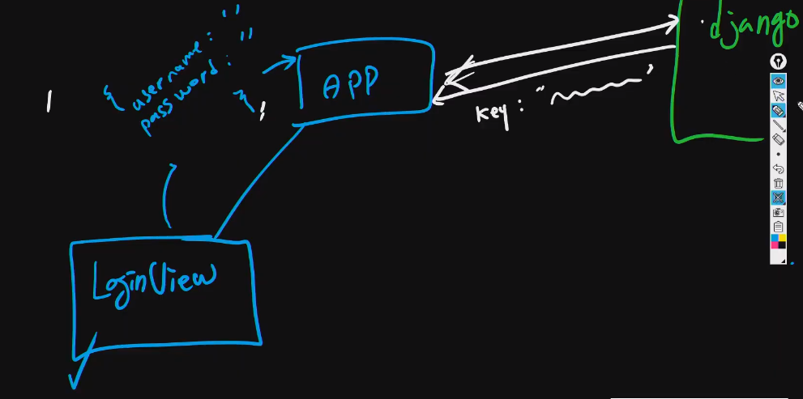
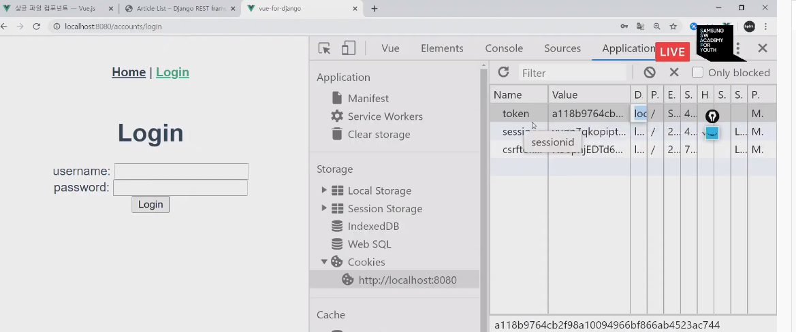
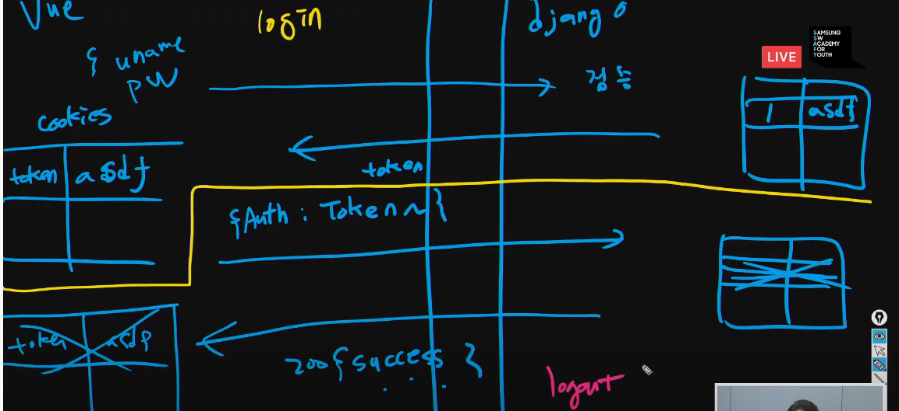
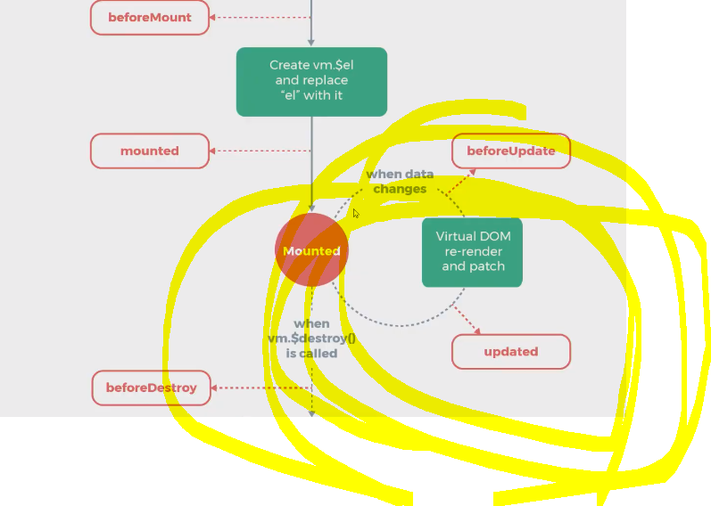

# 20200609 vue-django

- ajax요청(비동기요청)


- cors : 교차 출처 리소스 공유

> 모든 사람이 읽어야 한다. 
>
> 브라우저가 친절하다.  브라우저가 막는다.
>
> 비동기 요청에 한해서는 다른곳에서의 요청은 받아주지 않는다.
>
> 응답의 헤더에 `Access-Control-Allow-Origin header`가 없을 경우.


- cors 설치

  ```
  $ pip install django-cors-headers
  
  INSTALLED_APPS = [
      ...
      'corsheaders',
      ...
  ]
  
  MIDDLEWARE = [  # Or MIDDLEWARE_CLASSES on Django < 1.10
      ...
      'corsheaders.middleware.CorsMiddleware',
      'django.middleware.common.CommonMiddleware',
      ...
  ]
  
  
  ```

## vue add router

- API(application interface)






npm i axios


- login/signup




- cookie

```
npm install --save vue-cookies
```







----

# Zoom

django-rest-auth


- 

```
vue create [project]
vue add router
npm i axios
npm install --save vue-cookies

npm run serve
```

---

# 오후



- cookie를 공유하기 위해 데이터를 올려주었다. 
- 나의 선택지는...?

- 네비게이션 가드

### 프로젝트

- 맞춰해야 할 것을 정한다. - 규약..
  - API!!!! 가장 맞춰야 할 구간 : request, response 형태.
- 같이 일을 시작한다.


# tips

aws route 53으로 사서 시작하기.

